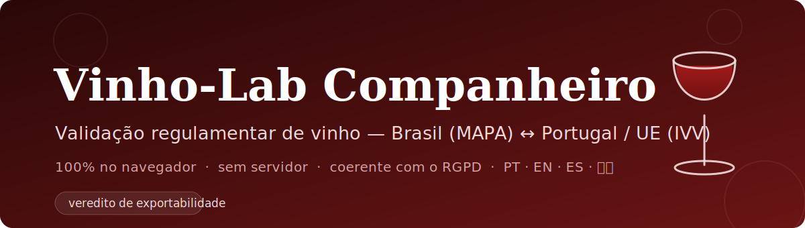

<a name="top"></a>

<p align="center">
  
</p>

<p align="center">
  
  
  
  
  
  
</p>

<p align="center">
  <b>Português</b> &nbsp;·&nbsp; <a href="#-english">English</a>
</p>

---

Companheiro de laboratório que valida **o mesmo vinho** contra dois regimes
regulamentares — **Brasil (MAPA, IN 14/2018)** e **Portugal / UE (IVV; Reg. UE
1308/2013, 2019/934 e 2018/848)** — e indica a **exportabilidade** entre eles.

Todo o processamento é feito **100 % no navegador**: sem servidor, sem analítica,
sem envio de dados. Coerente com o RGPD.

> [!WARNING]
> **Ferramenta de apoio à decisão.** Não substitui o boletim oficial de um
> laboratório autorizado. Os limites e as fórmulas provêm de legislação publicada,
> mas a responsabilidade pela interpretação e pela análise oficial é sempre de um
> laboratório acreditado.

## Motivação

> A ideia deste projeto nasceu da minha própria experiência num laboratório de
> análise de vinhos, onde percebi que um pouco de praticidade pode fazer
> diferença na realização de uma bateria de ensaios. Ao criar este webapp — com
> todo o processamento dos dados feito diretamente no seu computador, sem envio de
> valores para qualquer servidor — espero contribuir para uma melhor dinâmica no
> laboratório e ajudar a obter resultados próximos dos de um boletim oficial,
> permitindo compreender a qualidade e a legalidade de um vinho e perceber se
> cumpre as normas portuguesas e brasileiras (incluindo para efeitos de exportação
> ou importação entre os dois países).
>
> É um projeto em construção: por agora, recomendo que faça os cálculos em paralelo
> e confirme sempre os resultados.
>
> Espero que este projeto o possa ajudar — tal como espero que me ajude a mim.
>
> — _o autor_

## Funcionalidades

- **Validação cruzada BR ↔ PT/UE** por categoria de vinho, com conversão
  automática de unidades (ex.: `meq/L` ↔ `g/L`).
- **Veredito de exportabilidade** entre os dois regimes.
- **Calculadora de resultados** — calcula o valor final a partir das leituras
  brutas de bancada (volume de titulante, concentração, volume de amostra),
  usando as fórmulas oficiais **OIV**; o resultado flui para a validação.
- **Painel "Ver método OIV"** — princípio, equipamento, reagentes, procedimento,
  cálculo, precisão e aceitação regulatória de cada parâmetro.
- **Análise sensorial** (pontuação OIV + defeitos).
- **Margens de erro** (incerteza de medição) e **verificações de plausibilidade**.
- **Exportação de relatório** em **PDF** e **Markdown**, com memória de cálculo.
- **Importar / Exportar sessão** em `.json` para guardar e retomar o trabalho.
- **Interface multilíngue** — Português (PT-PT, fonte de verdade), Inglês,
  Espanhol e Chinês simplificado. A tradução abrange também todo o **conteúdo de
  domínio** (parâmetros, métodos OIV, critérios sensoriais), aplicada apenas na
  renderização.

## Princípio do projeto

**Nunca inventar valores legais nem fórmulas.** Todos os limites e fórmulas
analíticas provêm de JSON gerado a partir de um projeto de origem
(`data/legal/*.json`), que é a **fonte única de verdade** e nunca é editado à mão.
As traduções aplicam-se só na fronteira de renderização: **valores legais, limites
numéricos e fórmulas nunca são traduzidos**. Parâmetros que dependem de tabelas de
densidade OIV sem fórmula fechada (TAV, extrato seco, açúcares) mantêm entrada
direta do valor.

## Stack

- [Next.js 16](https://nextjs.org) (App Router, Turbopack) · React 19
- TypeScript (strict) · [Tailwind CSS v4](https://tailwindcss.com)
- [pdfmake](https://pdfmake.org) — geração de PDF no cliente
- Gestor de pacotes: **pnpm** · testes com **bun**

## Começar

```bash
pnpm install
pnpm dev      # servidor de desenvolvimento em http://localhost:3000
```

Outros scripts:

```bash
pnpm build    # build de produção
pnpm start    # servir o build
pnpm lint     # ESLint
pnpm test     # testes unitários (bun test)
pnpm check    # verificação completa: tipos + lint + testes
```

## Estrutura

```
app/                 Páginas e componentes (App Router)
  components/        Field, CalculatorTab, SensoryTab, ResultTab, MethodPanel…
lib/                 Núcleo: validate, canonical, fields, calculators, methods,
                     categories, legal, sensory, chemistry, report, markdown, pdf,
                     session, i18n, i18n-domain, i18n-methods
data/legal/*.json    Fonte de verdade: limites legais + métodos OIV (não editar)
tests/               Testes (bun), incl. cobertura de tradução de domínio
scripts/             Testes de fumo (smoke)
docs/                Recursos de documentação (banner)
```

Ver [`REGISTO-TRABALHO.md`](./REGISTO-TRABALHO.md) para um registo detalhado da
arquitetura e das decisões de implementação.

## Roadmap & limitações conhecidas

- **Exportações ainda em PT.** O PDF e o Markdown saem em português; a tradução
  multilíngue cobre a interface, não (ainda) os relatórios exportados.
- **Origem dos valores legais.** A correção depende do JSON a montante
  (`data/legal/`); a app garante uso fiel, não a exatidão na fonte.
- **Cobertura de tradução** é verificada por teste automático (presença das
  chaves), mas a *correção* linguística de EN/ES/ZH deve ser revista por nativos.
- **Próximos passos:** localizar as exportações, demonstração pública (deploy),
  ampliar categorias e métodos conforme a legislação evoluir.

## Deploy

Otimizado para [Vercel](https://vercel.com): importar o repositório e o deploy é
automático (sem variáveis de ambiente — a app é totalmente client-side).

## Licença

Distribuído sob a licença MIT. Ver [`LICENSE`](./LICENSE).

<br>

---

<a name="-english"></a>

<p align="center">
  <a href="#top">Português</a> &nbsp;·&nbsp; <b>English</b>
</p>

# 🍷 Vinho Lab Comp

A laboratory companion that validates **the same wine** against two regulatory
regimes — **Brazil (MAPA, IN 14/2018)** and **Portugal / EU (IVV; EU Reg.
1308/2013, 2019/934 and 2018/848)** — and reports whether it is **exportable**
between them.

All processing runs **100 % in the browser**: no server, no analytics, no data
ever sent. GDPR-friendly by design.

> [!WARNING]
> **Decision-support tool.** It does not replace the official report of an
> accredited laboratory. Limits and formulas come from published legislation, but
> interpretation and official analysis always remain the responsibility of an
> accredited lab.

## Motivation

> The idea for this project grew out of my own experience working in a
> wine-analysis laboratory, where I saw how a little practicality can make a real
> difference when running a battery of tests. By building this web app — with all
> data processing done directly on your own computer, with no values ever sent to a
> server — I hope to contribute to a smoother workflow in the lab and help produce
> results close to those of an official report, making it easier to gauge a wine's
> quality and legal compliance, and to see whether it meets Portuguese and
> Brazilian standards (including for export or import between the two countries).
>
> This is a work in progress: for now, I recommend running the calculations
> separately and always double-checking the results.
>
> I hope this project helps you — just as I hope it helps me.
>
> — _the author_

## Features

- **Cross-validation BR ↔ PT/EU** by wine category, with automatic unit
  conversion (e.g. `meq/L` ↔ `g/L`).
- **Exportability verdict** between the two regimes.
- **Results calculator** — computes the final value from raw bench readings
  (titrant volume, concentration, sample volume) using the official **OIV**
  formulas; the result flows into validation.
- **"View OIV method" panel** — principle, equipment, reagents, procedure,
  calculation, precision and regulatory acceptance for each parameter.
- **Sensory analysis** (OIV scoring + faults).
- **Error margins** (measurement uncertainty) and **plausibility checks**.
- **Report export** in **PDF** and **Markdown**, including the calculation trail.
- **Import / Export session** as `.json` to save and resume work.
- **Multilingual UI** — Portuguese (PT-PT, source of truth), English, Spanish and
  Simplified Chinese. Translation also covers all **domain content** (parameters,
  OIV methods, sensory criteria), applied only at the render boundary.

## Project principle

**Never invent legal values or formulas.** All limits and analytical formulas come
from JSON generated by an upstream source project (`data/legal/*.json`), which is
the **single source of truth** and is never hand-edited. Translations apply only at
the render boundary: **legal values, numeric limits and formulas are never
translated**. Parameters that depend on OIV density tables with no closed formula
(alcoholic strength, dry extract, sugars) keep direct value entry.

## Stack

- [Next.js 16](https://nextjs.org) (App Router, Turbopack) · React 19
- TypeScript (strict) · [Tailwind CSS v4](https://tailwindcss.com)
- [pdfmake](https://pdfmake.org) — client-side PDF generation
- Package manager: **pnpm** · tests with **bun**

## Getting started

```bash
pnpm install
pnpm dev      # dev server at http://localhost:3000
```

Other scripts:

```bash
pnpm build    # production build
pnpm start    # serve the build
pnpm lint     # ESLint
pnpm test     # unit tests (bun test)
pnpm check    # full check: types + lint + tests
```

## Project structure

```
app/                 Pages and components (App Router)
  components/        Field, CalculatorTab, SensoryTab, ResultTab, MethodPanel…
lib/                 Core: validate, canonical, fields, calculators, methods,
                     categories, legal, sensory, chemistry, report, markdown, pdf,
                     session, i18n, i18n-domain, i18n-methods
data/legal/*.json    Source of truth: legal limits + OIV methods (do not edit)
tests/               Tests (bun), incl. domain-translation coverage
scripts/             Smoke tests
docs/                Documentation assets (banner)
```

See [`REGISTO-TRABALHO.md`](./REGISTO-TRABALHO.md) (in Portuguese) for a detailed
log of the architecture and implementation decisions.

## Roadmap & known limitations

- **Exports are still in PT.** PDF and Markdown are generated in Portuguese;
  multilingual support covers the UI, not (yet) the exported reports.
- **Origin of legal values.** Correctness depends on the upstream JSON
  (`data/legal/`); the app guarantees faithful use, not source accuracy.
- **Translation coverage** is verified by an automated test (key presence), but
  the linguistic *correctness* of EN/ES/ZH should be reviewed by native speakers.
- **Next steps:** localize the exports, public demo (deploy), broaden categories
  and methods as legislation evolves.

## Deploy

Optimized for [Vercel](https://vercel.com): import the repository and deployment is
automatic (no environment variables — the app is fully client-side).

## License

Distributed under the MIT License. See [`LICENSE`](./LICENSE).
